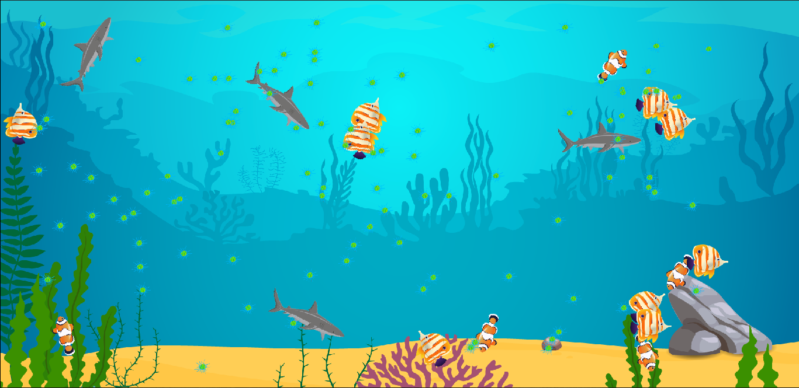
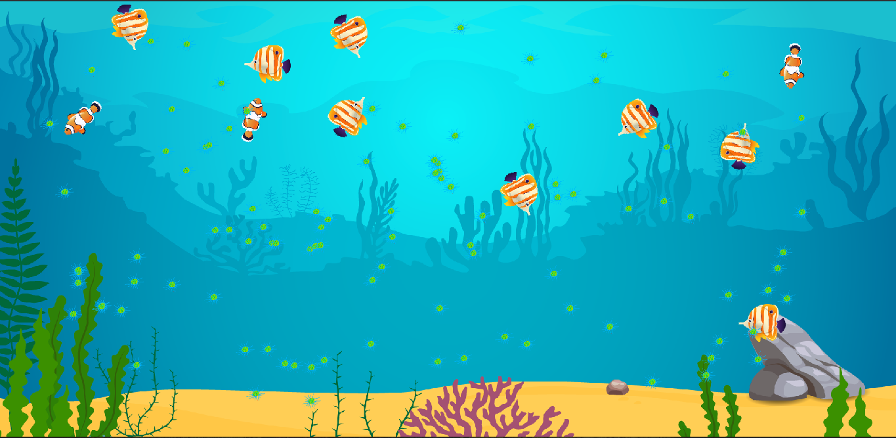

# Аквариум

## Немного о проекте
 * С/C++, SFML
 * Защитили на 10
 * Писали 2 недели с перерывами, +- 60 часов
 * Самое сложное было разбираться углами и расстояниями между рыбами, но
 * хорошо был очень умный человек разбирающийся в линейной алгебре.

## ТЗ:
Разработать модель экологической замкнутой системы "Аквариум"
В аквариуме есть планктон. Он плавает, питается солнечным светом(ничем), размножается и умирает.
В аквариуме есть рыбки, которые питаются планктоном. Рыбки плавают, едят планктон, размножаются. Простой вариант - обычным почкованием,
более сложный - половым путем. 
В аквариуме также есть хищные рыбки, которые охотятся на рыбок, питающихся планктоном.
Задача: подобрать такие параметры аквариума (количество планктона и разных рыб, время жизни, частота размножения, сколько времени может объект прожить без питания,
особенности поведения - приоритет размножения или питания, скорость объектов, дальность зрения, способность убегать от хищников), чтобы установился биоценоз.

Можно звездочку? ⭐️

